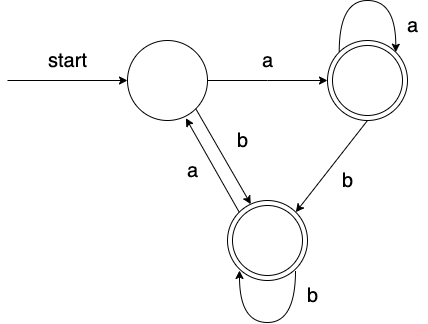

# 形式语言与自动机．期末考

2021 秋　考题回忆版　by BoxWorld

## 一、判断题（1@2）

1. 存在可以接受对角语言 $L_d$ 的多栈 PDA。

2. 在一个 DFA 中，设状态 $r$ 和 $s$ 通过某个输入符号 $a$ 可分别转移到 $p$ 和 $q$ （即 $\delta(r,a)=p, \delta(s,a)=q$） 则有「$r$ 和 $s$ 可区别 $\Rightarrow$ $p$ 和 $q$ 可区别」。

3. 若 $L$ 是正规语言，$a$ 是字母表中的符号，则 $a\backslash L=\{w|aw\in L\}$ 也是正规语言。

4. 对角语言 $L_d$ 可以归约到通用语言 $L_u$ 的补语言。

5. 正规表达式 $0+(\varepsilon+1)(\varepsilon+1)^*0$ 可简化为 $1^*0$。

6. 图灵机停机问题是一个 *NP-complete* 问题。

7. 「两个正规语言是否拥有至少一个公共串」是可判定的。

8. 如果被施加替换（*substitution*）运算的某个语言是上下文无关语言，则进行替换运算之后得到的语言也是上下文无关语言。

## 二、单项选择题（1@2）

1. 下列语言中，（）不是递归可枚举语言。

   A. 语言 $L_u$ （课程定义的通用语言）

   B. 语言 $L_H$ （课程中图灵机停机问题所定义的语言）

   C. 语言 $L_H$ （课程中图灵机停机问题所定义的语言）的补语言

   D. 以上皆非

   

2. 下列问题中，（）是可判定的。

   A. 一个递归可枚举语言是否为空

   B. 一个递归可枚举语言是否为正规语言

   C. 一个递归可枚举语言是否为上下文无关语言

   D. 以上皆非

   

3. 下列语言中，（）不是任何 PDA 的语言。

   A. $\{ww|w\in\{a,b\}^*\}$

   B. $\{ww|w\in\{a,b\}^*\}$ 的补语言

   C. $\{ww^R|w\in\{a,b\}^*,w^R为w的反向\}$ 的补语言

   D. 以上皆非

   

4. 下列语言中，（）是某个 PDPA 的语言。

   A. $\{cww^R|w\in\{a,b\}^*,w^R为w的反向\}$

   B. $\{wcw^R|w\in\{a,b\}^*,w^R为w的反向\}$

   C. $\{ww^Rc|w\in\{a,b\}^*,w^R为w的反向\}$

   D. 以上皆非

   

5. 下列语言中，（）是某个空栈接受的 PDPA 的语言。

   A. $\{ww^R|w\in\{a,b\}^*,w^R为w的反向\}$ 的补语言

   B. $\{wcw^R|w\in\{a,b\}^*,w^R为w的反向\}$

   C. $\{wcw^R|w\in\{a,b\}^*,w^R为w的反向\}$ 的补语言

   D. 以上皆非

   

6. 下列语言中，（）不是任何 DFA 的语言

   A. $\{wxw^R|w,x\in\{a,b\}^*,w^R为w的反向\}$

   B. $\{wxw^R|w,x\in\{a,b\}^*,w^R为w的反向\}$ 的补语言

   C. $\{wxw|w,x\in\{a,b\}^*\}$

   D. 以上皆非

## 三、简答题

1. 【5 分】设 CFG $G=(\{S,A,B,C,D\},\{a,b,c\},P,S)$，其中 $P$ 由下列产生式构成：
   $$
   S\rightarrow AB|BC|\varepsilon\\
   A\rightarrow AB|C\\
   B\rightarrow Bb|a\\
   C\rightarrow \varepsilon|Cc\\
   D\rightarrow B|\varepsilon
   $$

   1. 消去 $P$ 中的 $\varepsilon$ - 产生式得到产生式集合 $P_1$，构成 CFG $G'$ ，使得 $L(G')=L(G)-\{\varepsilon\}$，求 $P_1$。
   2. 消去 $P_1$ 中的 Unit 产生式得到产生式集合 $P_2$，构成 CFG $G''$ ，使得 $L(G'')=L(G')$，求 $P_2$。
   3. 消去 $P_2$ 中的无用符号得到产生式集合 $P_3$，构成 CFG $G'''$ ，使得 $L(G''')=L(G'')$，求 $P_3$。
   4. 根据 $P_3$ 的结果，添加合适的非终结符，构造满足 Chomsky 范式要求的产生式集合 $P_4$，使得结果文法的语言与 $L(G''')$ 相等，求 $P_4$。

   

2. 【4 分】文法 G（S 为开始符号）的产生式集合为：
   $$
   S\rightarrow AB\\
   A\rightarrow SS|SA|b\\
   B\rightarrow BA|b|a
   $$

   | $\\X_{13}\\X_{12}\\X_{11}$ | $\\\\X_{23}\\X_{22}$ | $\\\\\\X_{33}$ |
   | -------------------------- | -------------------- | -------------- |
   | b                          | a                    | b              |

   上图表示对于文法 G 和字符串 *bab* 应用 CYK 算法时所构造的表。

   1. 分别计算图中所有 $X_{ij}$ $(1\leq i,j\leq3)$。
   2. 是否有  $bab\in L(G)$？

   

3. 【6 分】下图表示一个有限自动机 A：

   （注：本题中多处出现有限自动机的描述，可以是也可以不是 DFA）

   

   1. 试采用课程中所介绍的方法，给出一个有限自动机 B，使得 $L(B)=(L(A))^R$。 （$(L(A))^R$ 为 $L(A)$ 的反向）

   2. 试采用课程中的方法，给出一个有限自动机 C，使得 $L(C)=\{a,b\}^*-L(A)$。

   3. 设映射 $h:\{0,1\}\rightarrow\{a,b\}^*$ 定义为 $h(0)=ab, h(1)=ba$；

      试构造一个有限自动机 D，使得 $L(D)=h^{-1}(L(A))$。

   

4. 【6 分】考虑如下 PDA 状态转移图：

   

   该图刻画了 PDA $P=(\{q_0\},\{a,b\},\{Z_0,X,A,B\},\delta,q_0,Z_0)$ 的转移规则。

   1. 试严格利用课程中介绍的从空栈接受的 PDA 到 CFG 的转换算法，定义一个与该 PDA 等价的 CFG，开始符号设为 $S$。

   2. 对于该 PDA 接收的语言 $L(P)$，是否有
      $$
      L(P) \subseteq \{w|w=a^nb^m, 其中\ 0\leq m\leq 2n \leq 4m\}
      $$

   3. 该 PDA 接收的语言 $L(P)$ 是否为正规语言？结出结论即可。

   

5. 【6 分】若 *G* 为包含 $p$ 个产生式的上下文无关文法，其中每个产生式的长度小于等于 $n$。假设存在推导 $A \mathop{\Rightarrow}_{G}^{*} \varepsilon$ 则对于该推导存在推导步数的上界，使得一定存在一种推导方法的推导步数小于等于该上界。给定 $n$ 和 $p$ （$n,p\geq1$），求出这一上界，并对于这一上界，给出推导步数达上界的上下文无关文法。

   **例：**若 $n=2,p=2$ ，对应上界为 3，一个对应的 CFG 为 $A\Rightarrow BB,B\Rightarrow \epsilon$。

   **注：不需要**对推导步数的上界给出对应的证明。

   

6. 【4 分】定义两个语言 $L$ 和 $M$ 的对称差 $SD(L,M)$ 为所有仅被语言 $L$ 或 $M$ 中的一个所包含的字符串组成的集合。例如，若 $L=\{aa,bb\},M=\{bb, aab\}$，则 $SD(L,M)=\{aa,aab\}$。

   1. 给出 $SD(L,M)$ 的形式化描述。例：$L^+$ 的形式化描述为 $L^+=L^1\cup L^2\cup L^3\cup...$
   2. 若 $L,M$  均为 CFL，$SD(L,M)$ 是否一定是 CFL？给出证明或给出反例。

   

7. 【4 分】对于语言
   $$
   L=\{ss^Rs|s\in\{0,1\}^*,s^R\,为\,s\,的反向\}
   $$
   可以利用 Pumping 引理证明 $L$ 不是上下文无关语言，以下是一个证明概要：

   对于任意的 $n\geq1$，取 $s=①\in\{0,1\}^*$，令 $z=ss^Rs$，则 $z\in L$。
   对任意满足条件 $z=uvwxy\wedge vx\neq\varepsilon\wedge|vwx|\leq n$ 的 $u,v,w,x,y$，取 $k=②$，有 $uv^kwx^ky\notin L$。

   试在其中 ① 和 ② 处填写适当的内容。

## 四、设计题

1. 【5 分】构造接受下列语言 $L$ 的一个有限自动机（DFA，NFA，$\varepsilon$-NFA 均可），要求状态数不超过 8， 且用状态转移图的方式给出答案：
   $$
   L=\{w|w=a^nb^m,\ m,n\geq0\ ,且\ w\ 中既不包含子串\ aaabb，也不包含子串\ aabbbb\}
   $$
   注：要求状态数不超过 8，并不意味状态数一定会达到 8，后面的题目亦然。

2. 【5 分】给出下列正规语言 $L$ 的一个正规表达式：
   $$
   L=\{w|w=a^nb^m,\ m,n\geq0\ ,且\ w\ 中既不包含子串\ aaabb，也不包含子串\ aabbbb\}
   $$

3. 【5 分】给出下列语言 $L$ 的一个上下文无关文法 *G*，要求 *G* 的非终结符只有一个 *S*。用你的文法 *G* 验证：对于任意串 $w=a^nb^m\in L$，*w* 可被 *G* 接受。
   $$
   L=\{w|w=a^nb^m, 其中\ 0\leq m\leq 2n \leq 4m\}
   $$

4. 【5 分】试构造接受下列语言 $L$ 的一个 PDA（终态接受和空栈接受均可，必要时给出设计思路），要求该 PDA 的堆栈符号数不超过 3，且用状态转移图描述你的设计：
   $$
   L=\{w|w\in\{a,b\}^*,其中\ |w|\ 为偶数，且\ w\ 不为\ a^nb^n\ 的形式，其中\ n\geq0\}
   $$

5. 【5 分】试设计一个可停机图灵机 $M=(Q,\{0,1\},\{0,1...,B\},\delta,q_0,B,\{q_f\})$ 可以将串 $w\in\{0,1\}^*$ 作为输入，当到达终态 $q_f$ 时，带上的内容为将 *w* 从小到大排序后的结果。 **例：**如输入串为 101010，则到达终态时，带上的内容应为 000111。如输入串为 1000，则到达终态时，带上的内容应为 0001。如输入串全为 0 或全为 1，则到达终态时带上的内容不变。该图灵机的状态数不超过 7。到达 $q_f$ 时，对读写头在何处不作要求。用状态转移图描述你所设计的图灵机。

   

## 五、证明题

* 要求证明严谨，步骤明确。

1. 【4 分】已知语言 $L_{01}=\{0^k1^k|k\geq0\}$ 不是正规语言，试利用该结论及正规语言的封闭运算，证明如下语言 *L* 不是正规语言：
   $$
   L=\{w|w=a^nb^m, 其中\ 0\leq 3n = 2m\}
   $$

2. 【6 分】设有语言 $L=\{w|w=a^nb^m, 其中\ 0\leq m\leq 2n \leq 4m\}$。试问，*L* 是否存在一个非有穷子集是正规语言？如存在这样的非有穷子集，请给出一个例子；如不存在，请给出证明。

3. 【5 分】证明若 *L* 为上下文无关语言，*R* 为正规语言，则 *L* 和 *R* 的交 $L\cap R$ 为上下文无关语言。

   **提示：**考虑 *L* 对应的 PDA $P=(Q_P,\Sigma,\Gamma,\delta_P,q_p,Z_0,F_P)$ ，和 *R* 对应的 DFA $A=(Q_A,\Sigma,\delta_A,q_A,F_A)$，构造 $L\cap R$ 对应的自动机并进行证明。

## 六、附加题

* 5 分，直接加入总评成绩；共两题，任选一题。
* **注意：**附加题只有能呈现出核心思路才有可能得到部分分数，建议大家在前面题目已做完且进行充分检查之后，再看是否有时间考虑下列题目之一。

1. 对于 CFG $G=(V,T,P,S)$，我们先定义如下两个概念：活前缀（*viable prefix*）和增广文法（*augmented grammar*）。

   若 $S\Rightarrow_{rm}^* \alpha Aw$ 且 $A\Rightarrow \beta$，其中 $\alpha,\beta\in (V\cup T)^*$，$w\in T^*$，$\Rightarrow _{rm}^*$ 表示最右推导（多步），则 $\alpha\beta$ 的任何前缀 $\gamma$ 都是文法 *G* 的活前缀。

   若增加产生式 $S'\rightarrow S$，其中 $S'\notin V\cup T$，得到 *G* 的增广文法 $G=(V,T,P,S')$。

   现在，针对增广文法 *G'*，集合 *Prefix* 可归纳定义如下：

   1. 令 $S\in Prefix$；
   2. 若 $v\in Prefix$，则 *v* 的任一前缀 *u* 都满足 $u\in Prefix$；
   3. 若 $v\in Prefix$，且 *v* 中至少包含一个非终结符，即可以将 *v* 写成 $\alpha\beta\gamma$，其中 *B* 为非终符。若有产生式 $B\rightarrow\beta$ ，则 $\alpha\beta$ 的任一前缀 *u* 都满足 $u\in Prefix$；
   4. *Prefix* 中的元素只能通过上述步骤产生。

   试证明，*Prefix* 可以表示增广文法 *G'* 所有活前缀的集合。

   

2. 在空栈接受的扩展 PDA 基础上，我们引入一种便于自底向上分析的自动机。一个归约自动机（*Recursive Automaton*，简称 *RA*），是一个六元组：
   $$
   R=(Q,\Sigma,\Gamma,\delta,q_0,Z_0)
   $$
   其中，$Q,\Sigma,\Gamma$ 及 $q_0$ 与 PDA 的含义一致，但 $\delta$ 定义为：
   $$
   \delta=Q\times(\Sigma\cup \{\varepsilon\})\times(\Gamma-\{Z_\varepsilon\})^*\rightarrow 2^{Q\times\Gamma}
   $$
   $Z_\varepsilon\in\Gamma$ 是终栈符（*end stack symbol*）。定义与 PDA 中类似的 ID，形如（$q,w,\gamma$）。不同的是，栈顶在最右边。定义 ID 间的二元关系 $\vdash_R$：
   $$
   (q,aw,\gamma\alpha)\vdash_R(p,w,\gamma X)\ 当且仅当\ (p,X)\in\delta(q,a,\alpha)
   $$
   其中，$p,q\in Q$，$a\in\Sigma\cup\{\varepsilon\}$，$w\in\Sigma^*$，$X\in\Gamma$，$\alpha,\gamma\in\Gamma^*$。

   上述 *ID* 间二元关系 $\vdash _R$ 的自反传递闭包表示为 $\vdash _R^*$。定义 *R* 的语言
   $$
   L(R)=\{w|(q_0,w,\varepsilon)\vdash_R^* (q,\varepsilon,Z_\varepsilon), \ 其中, q\in Q\}
   $$
   试证明：对任一归约自动机 $R=(Q,\Sigma,\Gamma,\delta,q_0,Z_\varepsilon)$，存在某个上下文无关文法 *G*，使得 $L(G)=L(R)$。
